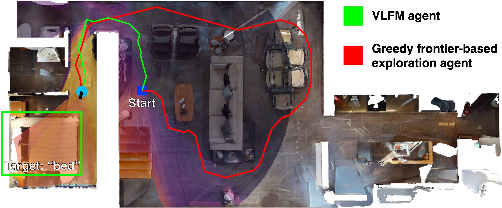

<p align="center">
  
  <h1 align="center">VLFM: Vision-Language Frontier Maps for Zero-Shot Semantic Navigation</h1>
  <h3 align="center">
    <a href="http://naoki.io/">Naoki Yokoyama</a>, <a href="https://faculty.cc.gatech.edu/~sha9/">Sehoon Ha</a>, <a href="https://faculty.cc.gatech.edu/~dbatra/">Dhruv Batra</a>, <a href="https://www.robo.guru/about.html">Jiuguang Wang</a>, <a href="https://bucherb.github.io">Bernadette Bucher</a>
  </h3>
  <p align="center">
    <a href="http://naoki.io/portfolio/vlfm.html">Project Website</a> , <a href="https://arxiv.org/abs/2312.03275">Paper (arXiv)</a>
  </p>
  <p align="center">
    <a href="https://github.com/bdaiinstitute/vlfm">
      
    </a>
    <a href="https://www.python.org/">
      
    </a>
    <a href="https://github.com/jiuguangw/Agenoria/actions">
      
    </a>
    <a href="https://github.com/psf/black">
      
    </a>
    <a href="https://github.com/astral-sh/ruff">
      
    </a>
    <a href="https://github.com/python/mypy">
      
    </a>
  </p>
</p>

## :sparkles: Overview

Understanding how humans leverage semantic knowledge to navigate unfamiliar environments and decide where to explore next is pivotal for developing robots capable of human-like search behaviors. We introduce a zero-shot navigation approach, Vision-Language Frontier Maps (VLFM), which is inspired by human reasoning and designed to navigate towards unseen semantic objects in novel environments. VLFM builds occupancy maps from depth observations to identify frontiers, and leverages RGB observations and a pre-trained vision-language model to generate a language-grounded value map. VLFM then uses this map to identify the most promising frontier to explore for finding an instance of a given target object category. We evaluate VLFM in photo-realistic environments from the Gibson, Habitat-Matterport 3D (HM3D), and Matterport 3D (MP3D) datasets within the Habitat simulator. Remarkably, VLFM achieves state-of-the-art results on all three datasets as measured by success weighted by path length (SPL) for the Object Goal Navigation task. Furthermore, we show that VLFM's zero-shot nature enables it to be readily deployed on real-world robots such as the Boston Dynamics Spot mobile manipulation platform. We deploy VLFM on Spot and demonstrate its capability to efficiently navigate to target objects within an office building in the real world, without any prior knowledge of the environment. The accomplishments of VLFM underscore the promising potential of vision-language models in advancing the field of semantic navigation.

## :hammer_and_wrench: Installation

### Getting Started
Create the conda environment:
```bash
conda_env_name=vlfm
conda create -n conda_env_name python=3.9 -y
conda activate conda_env_name
pip install torch==1.12.1+cu113 torchvision==0.13.1+cu113 -f https://download.pytorch.org/whl/torch_stable.html
pip install git+https://github.com/IDEA-Research/GroundingDINO.git@eeba084341aaa454ce13cb32fa7fd9282fc73a67 salesforce-lavis==1.0.2
```
If you are using habitat and are doing simulation experiments, install this repo into your env with the following:
```bash
pip install -e .[habitat]
```
If you are using the Spot robot, install this repo into your env with the following:
```bash
pip install -e .[reality]
```
#### [Whether you're using conda or not]
Clone the following repo within this one (simply cloning will suffice):
```bash
git clone git@github.com:WongKinYiu/yolov7.git
```

## :dart: Downloading the HM3D dataset

### Matterport
First, set the following variables during installation (don't need to put in .bashrc):
```bash
MATTERPORT_TOKEN_ID=<FILL IN FROM YOUR ACCOUNT INFO IN MATTERPORT>
MATTERPORT_TOKEN_SECRET=<FILL IN FROM YOUR ACCOUNT INFO IN MATTERPORT>
DATA_DIR=</path/to/vlfm/data>

# Link to the HM3D ObjectNav episodes dataset, listed here:
# https://github.com/facebookresearch/habitat-lab/blob/main/DATASETS.md#task-datasets
# From the above page, locate the link to the HM3D ObjectNav dataset.
# Verify that it is the same as the next two lines.
HM3D_OBJECTNAV=https://dl.fbaipublicfiles.com/habitat/data/datasets/objectnav/hm3d/v1/objectnav_hm3d_v1.zip
```

### Clone and install habitat-lab, then download datasets
*Ensure that the correct conda environment is activated!!*
```bash
# Download HM3D 3D scans (scenes_dataset)
python -m habitat_sim.utils.datasets_download \
  --username $MATTERPORT_TOKEN_ID --password $MATTERPORT_TOKEN_SECRET \
  --uids hm3d_train_v0.2 \
  --data-path $DATA_DIR &&
python -m habitat_sim.utils.datasets_download \
  --username $MATTERPORT_TOKEN_ID --password $MATTERPORT_TOKEN_SECRET \
  --uids hm3d_val_v0.2 \
  --data-path $DATA_DIR &&

# Download HM3D ObjectNav dataset episodes
wget $HM3D_OBJECTNAV &&
unzip objectnav_hm3d_v1.zip &&
mkdir -p $DATA_DIR/datasets/objectnav/hm3d  &&
mv objectnav_hm3d_v1 $DATA_DIR/datasets/objectnav/hm3d/v1 &&
rm objectnav_hm3d_v1.zip
```

## :weight_lifting: Downloading weights for various models
The weights for MobileSAM, GroundingDINO, and PointNav must be saved to the `data/` directory. The weights can be downloaded from the following links:
- `mobile_sam.pt`:  https://github.com/ChaoningZhang/MobileSAM
- `groundingdino_swint_ogc.pth`: https://github.com/IDEA-Research/GroundingDINO
- `yolov7-e6e.pt`: https://github.com/WongKinYiu/yolov7
- `pointnav_weights.pth`: included inside the [data](data) subdirectory

## :arrow_forward: Evaluation within Habitat
To run evaluation, various models must be loaded in the background first. This only needs to be done once by running the following command:
```bash
./scripts/launch_vlm_servers.sh
```
(You may need to run `chmod +x` on this file first.)
This command will create a tmux session that will start loading the various models used for VLFM and serving them through `flask`. When you are done, be sure to kill the tmux session to free up your GPU.

Run the following to evaluate on the HM3D dataset:
```bash
python -m vlfm.run
```
To evaluate on MP3D, run the following:
```bash
python -m vlfm.run habitat.dataset.data_path=data/datasets/objectnav/mp3d/val/val.json.gz
```

## :newspaper: License

VLFM is released under the [MIT License](LICENSE). This code was produced as part of Naoki Yokoyama's internship at the Boston Dynamics AI Institute in Summer 2023 and is provided "as is" without active maintenance. For questions, please contact [Naoki Yokoyama](http://naoki.io) or [Jiuguang Wang](https://www.robo.guru).

## :black_nib: Citation

If you use VLFM in your research, please use the following BibTeX entry.

```
@inproceedings{yokoyama2024vlfm,
  title={VLFM: Vision-Language Frontier Maps for Zero-Shot Semantic Navigation},
  author={Naoki Yokoyama and Sehoon Ha and Dhruv Batra and Jiuguang Wang and Bernadette Bucher},
  booktitle={International Conference on Robotics and Automation (ICRA)},
  year={2024}
}
```
